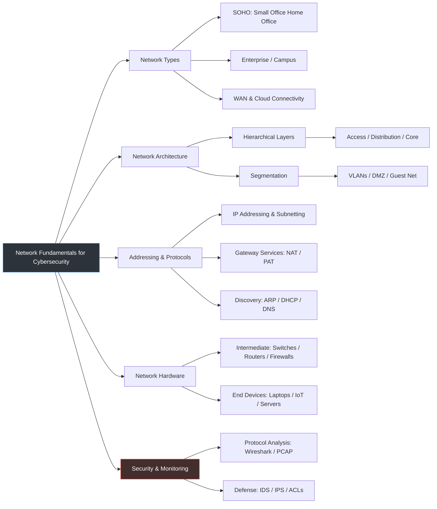
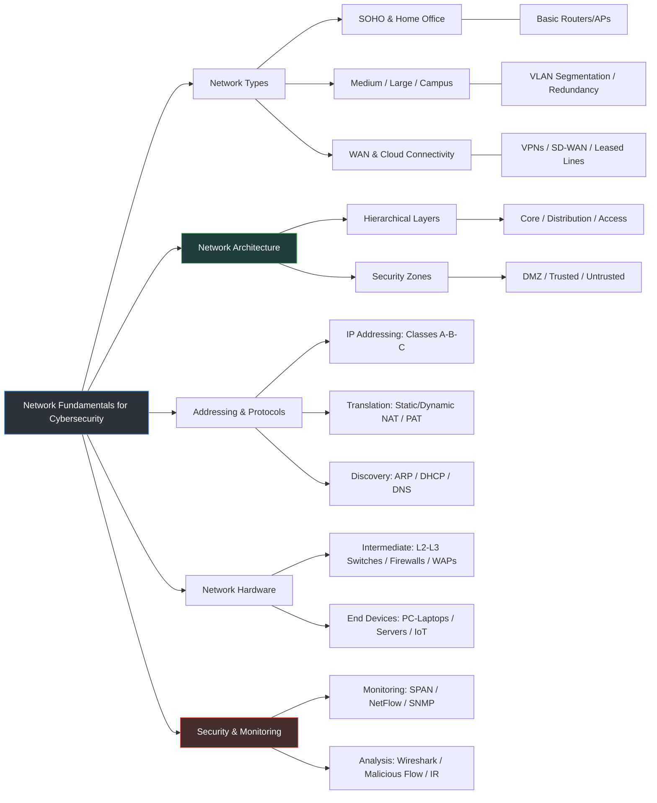

# CyberSecurity-Network-Handbook
# 🛡️ Network Fundamentals for Blue Teaming & Cyber Security

This repository is a comprehensive guide for those aiming to specialize in cybersecurity, covering critical network fundamentals, protocol analysis, and network architectures from a cybersecurity perspective.

> "If you don't understand the network, you cannot defend it."

## New

## 📌 Repository Modules

### 1. Network Types & Topologies
- **SOHO vs Enterprise:** Understanding attack surfaces in different environments.
- **WAN Security:** How data travels securely over untrusted links.

### 2. Hierarchical Architecture
- **The 3-Layer Model:** Access, Distribution, and Core layers.
- **Network Segmentation:** Implementing VLANs and DMZs to contain lateral movement.
  
### 3. Addressing & Protocols
- **IP & Subnetting:** Logical boundaries and broadcast domains.
- **Gateway Services:** Deep dive into NAT/PAT from a log analysis perspective.
- **Critical Services:** Security analysis of ARP, DHCP (DORA), and DNS.
  
### 4. Network Hardware
- **L2/L3 Devices:** How switches and routers make forwarding decisions.
- **Security Appliances:** The role of Next-Gen Firewalls and IDS/IPS in the flow.
  
### 5. Security & Monitoring
- **Traffic Analysis:** Mastering Wireshark and PCAP analysis for incident response.
- **Hardening:** Applying Access Control Lists (ACLs) and Port Security.
---

# Network Protocol Security & Analysis Table

This table provides a comprehensive overview of common network protocols, their security status, and key focus areas for Blue Team operations.

| Protocol | Port | Layer | Security Status | Blue Team Focus | Attack Vector |
| :--- | :--- | :--- | :--- | :--- | :--- |
| **ARP** | - | L2 | 🔴 Unencrypted | Dynamic ARP Inspection (DAI) / Static Tables | ARP Poisoning / MITM |
| **ICMP** | - | L3 | 🟠 No Auth | ICMP Tunneling Detection / Rate Limiting | Ping of Death / Smurf DoS |
| **TCP** | - | L4 | 🟡 Connection-oriented | 3-Way Handshake Monitoring / SYN Analysis | SYN Flood / Session Hijacking |
| **DHCP** | 67/68 | L7 (App) | 🟠 Unencrypted | DHCP Snooping / Port Security | Rogue DHCP / Starvation |
| **DNS** | 53 | L7 (App) | 🟠 Poisoning Risk | Query Logging / DNSSEC / Tunneling Check | Cache Poisoning / Exfiltration |
| **FTP** | 21 | L7 (App) | 🔴 Unencrypted | Disable Anonymous / Monitor Cleartext | vsftpd Backdoor / Sniffing |
| **SSH** | 22 | L7 (App) | 🟢 Encrypted | Key-based Auth / Brute Force Monitoring | Brute Force / Credential Stuffing |
| **HTTP** | 80 | L7 (App) | 🔴 Unencrypted | WAF Implementation / Force HTTPS | Sniffing / XSS / SQLi |
| **HTTPS** | 443 | L7 (App) | 🟢 Encrypted | TLS Inspection / Certificate Validation | Malicious Payload Delivery |
| **Telnet** | 23 | L7 (App) | 🔴 Unencrypted | **Decommission** / Traffic Sniffing Alert | Credential Sniffing / MITM |
| **SMTP** | 25/587 | L7 (App) | 🟡 Mixed | SPF, DKIM, DMARC / Mail Relay Check | Email Spoofing / Spam Relay |
| **POP3** | 110/995 | L7 (App) | 🟡 Mixed | Enforce SSL (995) / Log monitoring | Brute Force / Sniffing |
| **IMAP** | 143/993 | L7 (App) | 🟡 Mixed | Enforce SSL (993) / Anomaly Detection | Credential Stuffing / Phishing |
| **NTP** | 123 | L7 (App) | 🟠 No Auth | NTP Stratum Monitoring / Restrict Monlist | NTP Amplification (DoS) |
| **NetBIOS**| 137-139| L7 (App) | 🔴 Unencrypted | Disable on WAN / Monitor SMB Relay | Name Poisoning / LLMNR Spoofing |
| **RDP** | 3389 | L7 (App) | 🟠 Vulnerable | Network Level Auth (NLA) / VPN Only | BlueKeep / Brute Force |

### Legend
*   🟢 **Secure**: Encrypted by default.
*   🟡 **Neutral**: Depends on configuration (e.g., STARTTLS).
*   🟠 **Weak**: Lacks inherent authentication or encryption.
*   🔴 **Critical**: Transmits data in cleartext or highly vulnerable.

---

## 🚀 Project Objectives
This study aims to demonstrate not only theoretical networking knowledge but also how this knowledge is used in **SOC Analysis**, **Penetration Testing**, and **Network Security** processes.

---
*Prepared by: Kubra Bozdogan*

