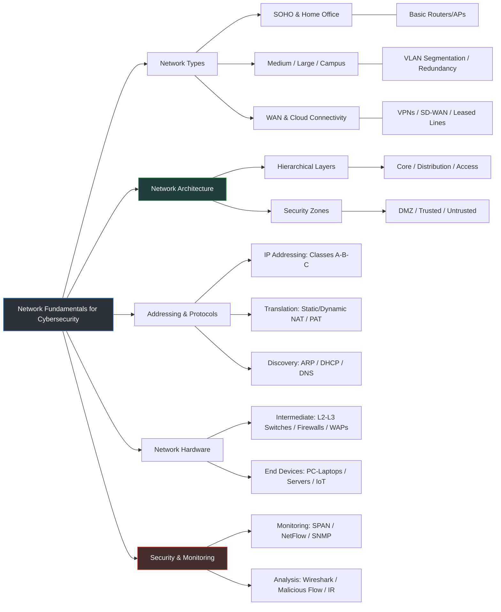

# CyberSecurity-Network-Handbook
# 🛡️ Network Fundamentals for Blue Teaming & Cyber Security

This repository is a comprehensive guide to understanding network fundamentals from a **Cybersecurity** perspective. It follows a structured approach from basic connectivity to advanced security monitoring.

> "If you don't understand the network, you cannot defend it. A defender's advantage is knowing the terrain better than the adversary."

## 🗺️ Master Architecture

This diagram represents the full scope of this handbook, blending core networking with defensive security concepts.

## 📂 Repository Structure & Modules

### 1. [Network Types & Topologies](./Modules/01-Network-Types/)
*Focus: Understanding the attack surface in different environments.*
*   **SOHO & Remote Office:** Securing basic home/office gateways.
*   **Enterprise (Campus):** High availability, redundancy, and VLAN security.
*   **WAN & Cloud:** Securing data in transit via VPNs and SD-WAN.

### 2. [Network Architecture & Design](./Modules/02-Architecture/)
*Focus: Structural defense and segmentation.*
*   **The 3-Layer Model:** Roles of Core, Distribution, and Access layers.
*   **Security Zones:** Architecting DMZs, Trusted Internal Networks, and Untrusted External boundaries.

### 3. [Addressing & Protocol Analysis](./Modules/03-Protocols/)
*Focus: How data moves and how it's intercepted.*
*   **IP Fundamentals:** Classes (A/B/C), Subnetting, and logical boundaries.
*   **Address Translation:** Security implications of Static/Dynamic NAT and PAT (Overload).
*   **Discovery Services:** Deep dive into **ARP** (MITM), **DHCP** (Snooping), and **DNS** (Exfiltration).

### 4. [Network Hardware & Endpoints](./Modules/04-Hardware/)
*Focus: Hardening the physical and virtual assets.*
*   **Intermediary Devices:** L2/L3 Switches, Routers, and Next-Gen Firewalls (NGFW).
*   **End Devices:** Securing Laptops, Servers, and the growing IoT attack surface.

### 5. [Security, Monitoring & IR](./Modules/05-Security/)
*Focus: Identifying and responding to threats.*
*   **Traffic Monitoring:** SPAN/RSPAN, SNMP, and NetFlow analysis.
*   **Threat Hunting:** Protocol analysis with Wireshark and detecting malicious traffic patterns.

---

## 🛡️ Protocol Security & Defensive Analysis Matrix

This table provides a comprehensive overview of common network protocols, their security status, and key focus areas for Blue Team operations.

| Protocol | Port | Layer | Security Status | Blue Team Focus | Attack Vector |
| :--- | :--- | :--- | :--- | :--- | :--- |
| **ARP** | - | L2 | 🔴 Unencrypted | Dynamic ARP Inspection (DAI) / Static Tables | ARP Poisoning / MITM |
| **ICMP** | - | L3 | 🟠 No Auth | ICMP Tunneling Detection / Rate Limiting | Ping of Death / Smurf DoS |
| **TCP** | - | L4 | 🟡 Connection-oriented | 3-Way Handshake Monitoring / SYN Analysis | SYN Flood / Session Hijacking |
| **DHCP** | 67/68 | L7 (App) | 🟠 Unencrypted | DHCP Snooping / Port Security | Rogue DHCP / Starvation |
| **DNS** | 53 | L7 (App) | 🟠 Poisoning Risk | Query Logging / DNSSEC / Tunneling Check | Cache Poisoning / Exfiltration |
| **FTP** | 21 | L7 (App) | 🔴 Unencrypted | Disable Anonymous / Monitor Cleartext | vsftpd Backdoor / Sniffing |
| **SSH** | 22 | L7 (App) | 🟢 Encrypted | Key-based Auth / Brute Force Monitoring | Brute Force / Credential Stuffing |
| **HTTP** | 80 | L7 (App) | 🔴 Unencrypted | WAF Implementation / Force HTTPS | Sniffing / XSS / SQLi |
| **HTTPS** | 443 | L7 (App) | 🟢 Encrypted | TLS Inspection / Certificate Validation | Malicious Payload Delivery |
| **Telnet** | 23 | L7 (App) | 🔴 Unencrypted | **Decommission** / Traffic Sniffing Alert | Credential Sniffing / MITM |
| **SMTP** | 25/587 | L7 (App) | 🟡 Mixed | SPF, DKIM, DMARC / Mail Relay Check | Email Spoofing / Spam Relay |
| **POP3** | 110/995 | L7 (App) | 🟡 Mixed | Enforce SSL (995) / Log monitoring | Brute Force / Sniffing |
| **IMAP** | 143/993 | L7 (App) | 🟡 Mixed | Enforce SSL (993) / Anomaly Detection | Credential Stuffing / Phishing |
| **NTP** | 123 | L7 (App) | 🟠 No Auth | NTP Stratum Monitoring / Restrict Monlist | NTP Amplification (DoS) |
| **NetBIOS**| 137-139| L7 (App) | 🔴 Unencrypted | Disable on WAN / Monitor SMB Relay | Name Poisoning / LLMNR Spoofing |
| **RDP** | 3389 | L7 (App) | 🟠 Vulnerable | Network Level Auth (NLA) / VPN Only | BlueKeep / Brute Force |

### Legend
*   🟢 **Secure**: Encrypted by default.
*   🟡 **Neutral**: Depends on configuration (e.g., STARTTLS).
*   🟠 **Weak**: Lacks inherent authentication or encryption.
*   🔴 **Critical**: Transmits data in cleartext or highly vulnerable.

---

## 🚀 Project Objectives
This project aims to integrate theoretical networking with practical **SOC Analysis**, **Penetration Testing**, and **Network Security** processes.

# How to use this handbook:
1.  **Clone the Repo:** Explore the modules in numeric order.
2.  **Lab Exercises:** Check the `/Labs` folder for PCAP samples and Cisco Packet Tracer files.
3.  **Contribute:** Contributions to Blue Team hardening guides are welcome!
   
---
*Prepared by: Kubra Bozdogan*

